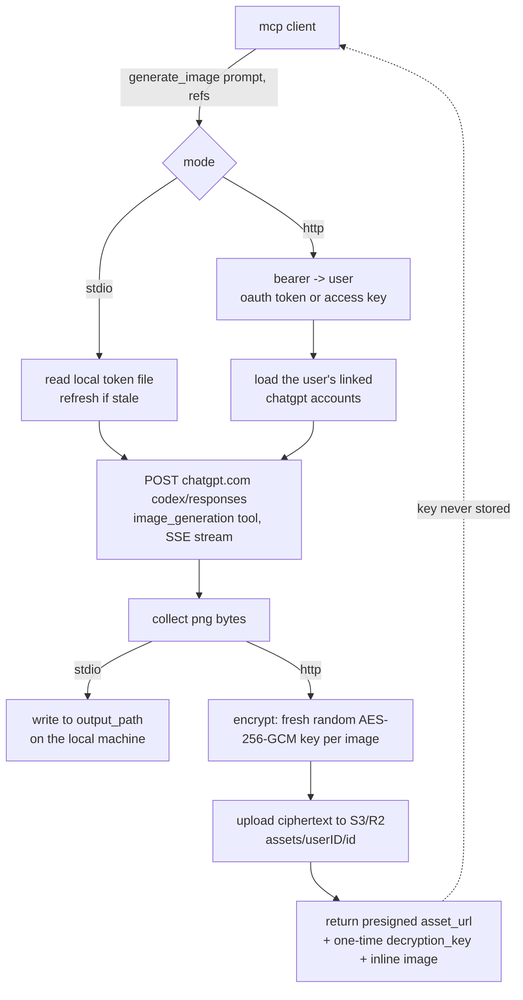

# pintr

pintr is a small mcp server that generates images through the Codex image model
using your own ChatGPT login, so there is no separate api key to manage. it
speaks the model context protocol, so any mcp client (like claude code) can call
its one tool: `generate_image`.

it runs two ways:

- **stdio** — a single local user; your mcp client starts the binary. tokens
  live in a local file, and the png is written to a path you pass.
- **http** — a hosted, multi-user app with a dashboard and the standard mcp
  oauth flow; generated images are encrypted and stored in object storage. this
  is what runs at `pintr.giuli.dev`.

the two modes differ in real ways (where tokens live, where the image goes), so
they are described separately below rather than as one story.

## pipeline



## build

you need go 1.26 or newer.

```
go build -o pintr .
```

## stdio mode (local, single user)

point your mcp client at the binary. for claude code, add to `.mcp.json`:

```json
{
  "mcpServers": {
    "pintr": {
      "command": "/full/path/to/pintr",
      "args": []
    }
  }
}
```

the first time the tool is used with no saved auth, pintr runs a browser login:
it opens the ChatGPT sign-in page, catches the redirect on `localhost:1455`, and
writes the tokens to `~/.config/pintr/auth.json` (mode 0600). after that the
access token is refreshed automatically from the stored refresh token. you can
also run the login by hand first:

```
./pintr login
```

in stdio mode `generate_image` writes the png to the `output_path` you pass —
this is safe because the server and the client are the same machine.

## http mode (hosted, multi-user)

used at `pintr.giuli.dev`.

1. open the site, create an account (email + password). you get a personal
   access key, shown once.
2. on the dashboard, click **link a chatgpt account**: open the ChatGPT link,
   sign in, and — because the public Codex oauth client only redirects to
   `localhost:1455`, which is *your* machine, not the server — the browser lands
   on a page that fails to load. that is expected. copy that full url from the
   address bar and paste it back into the dashboard; pintr exchanges the code
   server-side. you can link more than one account and pick a default; the rest
   are used as failover.
3. connect your mcp client by url:

```
claude mcp add --transport http pintr https://pintr.giuli.dev/mcp
```

on first connect the client gets a 401, discovers the oauth endpoints, and opens
your browser; you log in to pintr and click allow, and the client receives its
own token (auto-refreshed). the same flow works in any mcp client with remote
support: claude code, claude desktop (add a custom connector with the url),
codex, and so on. for scripts and curl, send your access key directly as
`Authorization: Bearer pintr_...`.

## the tool: generate_image

| field | required | what it is |
| --- | --- | --- |
| `prompt` | yes | the full image prompt |
| `reference_images` | no | reference images to anchor a look or character: `ref_` upload handles or base64/`data:` urls (hosted), or file paths (local stdio). uploads are encrypted and expire after 1 hour |
| `output_path` | no | stdio mode only: where to write the png. ignored by the hosted server |

the driver model is fixed to `gpt-5.6-terra` server-side, so a client cannot pass
a bogus or unexpected model.

delivery differs by mode:

- **stdio**: the png is written to `output_path`.
- **hosted**: see below.

## how the hosted server handles your data

being blunt about what is and isn't stored, because it matters:

- **ChatGPT tokens** (the credentials for your linked accounts) are stored in the
  server's sqlite database, **encrypted at rest** with AES-256-GCM. the key is
  derived from the server's `PINTR_SECRET`, which lives only in the server's
  environment, never in the database. each token blob is bound to its row, so a
  stolen blob can't be moved to another account.
- **passwords** are hashed with argon2id (never stored or logged in the clear).
- **generated images** are **end-to-end encrypted from the server's point of
  view**: each image gets a *fresh random AES-256-GCM key*, the png is encrypted,
  and only the ciphertext is uploaded to your object storage (Cloudflare R2 or
  any S3-compatible bucket), under `assets/<your-user-id>/<random-id>`. that
  per-image key is returned to you **once**, in the `generate_image` response,
  and is **never written anywhere** — not to the database, not to logs, not to
  the bucket. consequences, stated plainly:
  - the bucket and pintr itself only ever hold ciphertext they cannot read.
  - the dashboard **cannot show you your images** — there are no keys to decrypt
    them with. it can only tell you how many you have and **delete all of them**.
  - if you lose the key from a response, that image is unrecoverable by design.
- **reference images**: in hosted mode, upload them to `/upload` and pass the
  returned `ref_` handle (or inline base64 / `data:` url for small images); the
  server will not read a file path off its own disk. uploads are encrypted like
  generated images (the key lives only inside the handle, never server-side) and
  are **deleted automatically 1 hour after upload** — within that hour the same
  handle can be reused across calls.
- the `generate_image` response gives you a **presigned download url** for the
  ciphertext (valid ~24h) plus the `decryption_key`. to get the png: download
  the url, then AES-256-GCM decrypt with the key — the 12-byte nonce is the
  first bytes of the blob. for example:

```python
import base64, urllib.request
from cryptography.hazmat.primitives.ciphers.aead import AESGCM
blob = urllib.request.urlopen(ASSET_URL).read()
key = base64.b64decode(DECRYPTION_KEY)
open("image.png", "wb").write(AESGCM(key).decrypt(blob[:12], blob[12:], None))
```

what pintr does **not** claim to protect against: pintr is the party that runs
the generation, so it necessarily sees each png in memory at creation time and
mints the key. the encryption protects data **at rest** (the bucket operator,
backups, a stolen db) — not against a compromised pintr process itself.

## host it yourself

copy `.env.example` to `.env` and fill it in:

```
PINTR_PUBLIC_URL=https://your-host     # public https base clients reach
PINTR_DB=/var/lib/pintr/pintr.db       # sqlite file
PINTR_SECRET=<random 32+ chars>        # signs oauth tokens + encrypts stored creds
PINTR_S3_ENDPOINT=...                   # S3/R2 endpoint, bucket, and keys
PINTR_S3_BUCKET=...
PINTR_S3_ACCESS_KEY_ID=...
PINTR_S3_SECRET_ACCESS_KEY=...
PINTR_S3_REGION=auto
```

then:

```
./pintr -http 127.0.0.1:8090
```

- `PINTR_SECRET` must be stable — rotating it makes every stored ChatGPT token
  undecryptable (users must re-link).
- put a reverse proxy (nginx, caddy) with https in front. the mcp endpoint
  streams its replies, so turn response buffering off.
- without `PINTR_S3_*` the server still runs, but `generate_image` returns an
  error until storage is configured.

## contributing

see [CONTRIBUTING.md](CONTRIBUTING.md). llm-generated contributions are welcome,
but everything is human-reviewed before merge.

## notes

this uses the public Codex oauth client and normal user login, the same way the
Codex cli and other tools do.
