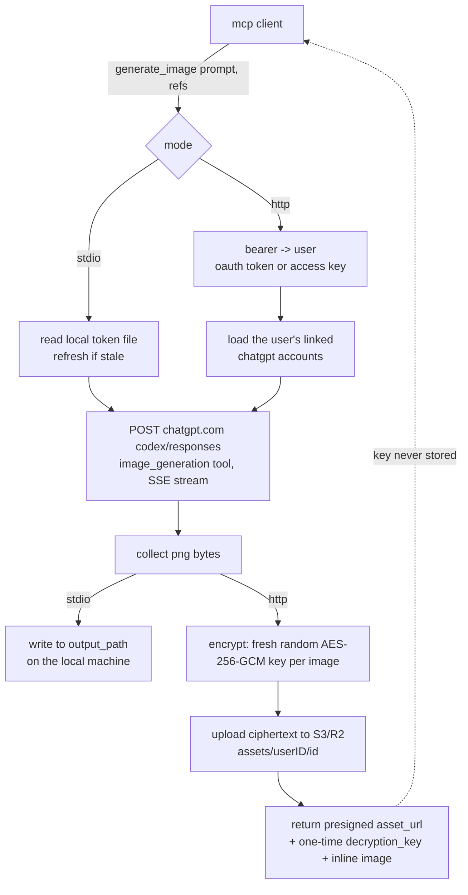

# pintr

pintr is a small mcp server that generates images through the Codex image model
using your own ChatGPT login, so there is no separate api key to manage. it
speaks the model context protocol, so any mcp client (like claude code) can call
its main tool: `generate_image`. the hosted server adds `generate_video`, which
drives Runway with your own Runway login.

it runs two ways:

- **stdio** — a single local user; your mcp client starts the binary. tokens
  live in a local file, and the png is written to a path you pass.
- **http** — a hosted, multi-user app with a dashboard and the standard mcp
  oauth flow; generated images are encrypted and stored in object storage. this
  is what runs at `pintr.giuli.dev`.

the two modes differ in real ways (where tokens live, where the image goes), so
they are described separately below rather than as one story.

## pipeline


```mermaid
flowchart TD
    C[mcp client] -->|generate_image prompt, refs| MODE{mode}

    MODE -->|stdio| S1[read local token file<br/>refresh if stale]
    MODE -->|http| H1[bearer -> user<br/>oauth token or access key]

    S1 --> GEN
    H1 --> H2[load the user's linked<br/>chatgpt accounts]
    H2 --> GEN

    GEN[POST chatgpt.com codex/responses<br/>image_generation tool, SSE stream] --> PNG[collect png bytes]

    PNG -->|stdio| SOUT[write to output_path<br/>on the local machine]
    PNG -->|http| ENC[encrypt: fresh random AES-256-GCM key per image]
    ENC --> UP[upload ciphertext to S3/R2<br/>assets/userID/id]
    UP --> RESP[return presigned asset_url<br/>+ one-time decryption_key + inline image]
    RESP -.->|key never stored| C
```

## build

you need go 1.26 or newer.

```
go build -o pintr ./cmd/pintr
```

## stdio mode (local, single user)

point your mcp client at the binary. for claude code, add to `.mcp.json`:

```json
{
  "mcpServers": {
    "pintr": {
      "command": "/full/path/to/pintr",
      "args": []
    }
  }
}
```

the first time the tool is used with no saved auth, pintr runs a browser login:
it opens the ChatGPT sign-in page, catches the redirect on `localhost:1455`, and
writes the tokens to `~/.config/pintr/auth.json` (mode 0600). after that the
access token is refreshed automatically from the stored refresh token. you can
also run the login by hand first:

```
./pintr login
```

in stdio mode `generate_image` writes the png to the `output_path` you pass —
this is safe because the server and the client are the same machine.

## http mode (hosted, multi-user)

used at `pintr.giuli.dev`.

1. open the site, create an account (email + password). you get a personal
   access key, shown once.
2. on the dashboard, click **link a chatgpt account**: open the ChatGPT link,
   sign in, and — because the public Codex oauth client only redirects to
   `localhost:1455`, which is *your* machine, not the server — the browser lands
   on a page that fails to load. that is expected. copy that full url from the
   address bar and paste it back into the dashboard; pintr exchanges the code
   server-side. you can link more than one account and pick a default; the rest
   are used as failover.
3. connect your mcp client by url:

```
claude mcp add --transport http pintr https://pintr.giuli.dev/mcp
```

on first connect the client gets a 401, discovers the oauth endpoints, and opens
your browser; you log in to pintr and click allow, and the client receives its
own token (auto-refreshed). the same flow works in any mcp client with remote
support: claude code, claude desktop (add a custom connector with the url),
codex, and so on. for scripts and curl, send your access key directly as
`Authorization: Bearer pintr_...`.

## the tool: generate_image

| field | required | what it is |
| --- | --- | --- |
| `prompt` | yes | the full image prompt |
| `reference_images` | no | reference images to anchor a look or character. **Local stdio only:** pass local file paths; the server runs on your machine and reads them from disk. **Hosted Claude:** pass the returned `ref_` handle described below. |
| `reference_image_files` | no | **Hosted ChatGPT only:** attached images supplied by ChatGPT. Attach the image to the conversation and call `generate_image`; do not manually construct file descriptors. |

the driver model is fixed to `gpt-5.6-terra` server-side, so a client cannot pass
a bogus or unexpected model.

delivery differs by mode:

- **stdio**: the png is written to a pintr-chosen cache path, returned as `saved_path`.
- **hosted**: see below.

## the tool: generate_video (hosted only)

generates video through Runway, using your own Runway login. Runway has no oauth
and no api key for its video tools, so the credential is the bearer token your
logged-in browser holds: dashboard → **runway** tab → paste the `RW_USER_TOKEN`
value from devtools (Application → Local storage → `app.runwayml.com`). it is
validated against Runway before it is saved, stored encrypted (AES-256-GCM,
bound to your pintr user), and only ever sent to Runway. Runway tokens last 30
days with no refresh, so the dashboard shows the expiry and warns before it
lapses.

| field | required | what it is |
| --- | --- | --- |
| `prompt` | yes¹ | the full video prompt |
| `reference_images` | no | `ref_` handles from `request_reference_upload`, same flow as `generate_image`. address them from the prompt as `@Image1`, `@Image2`, … in the order listed |
| `reference_image_files` | no | **Hosted ChatGPT only:** attached images, as with `generate_image` |
| `first_frame_image` / `end_frame_image` | no | `ref_` handles pinning the exact opening and closing image. an end frame requires a first frame |
| `model` | no | defaults to `seedance_2`; restricted to an allowlist of video models |
| `duration_seconds` | no | Seedance takes 4–15, defaults to 5 |
| `aspect_ratio` | no | defaults to `16:9` |
| `resolution` | no | defaults to `720p`. **Seedance only supports 720p in explore mode**, and explore mode is the only mode pintr uses |
| `audio` | no | defaults to true, on models that support it |
| `task_id` | no | ¹resume a generation from an earlier call; pass it alone, with no prompt |

**references vs keyframes.** these are different mechanisms and models differ in
which they accept. references (`reference_images`) anchor a character, place or
style and are addressed from the prompt as `@Image1`, `@Image2`, …; only the
`seedance_2` family takes them (up to 9). keyframes (`first_frame_image`,
`end_frame_image`) pin the exact first and last image; most other models take
keyframes instead, and `gen4`, `gen4_turbo` and `kling_3_0_turbo` take a first
frame only. `seedance_2` accepts both at once, which is why it is the default.
under the hood both ride in Runway's single `referenceImages` array — keyframes
tagged `first_frame`/`end_frame`, references untagged — and pintr validates the
combination against the model before submitting.

the per-model capability table in `internal/runway/models.go` was read out of
Runway's own web-app model registry rather than guessed, but it is a snapshot;
if Runway changes a model underneath us it may need refreshing.

`generate_video` **submits and returns immediately** with a `task_id` — it never
returns the video. generations always run in Runway's **explore mode**: no
credits are spent, but they queue, and the whole job commonly takes 10-20
minutes. an MCP client will not hold a tool call open that long: it cuts the
call off, and since the `task_id` only existed inside that call, the generation
is left running with no way to find it again. so submitting and polling are
separate tools.

## the tool: video_queue (hosted only)

the polling companion. no arguments lists recent generations with status and
progress — use it to see what is in flight, and to recover the `task_id` of a
generation whose `generate_video` call was cut off (the job keeps running on
Runway either way). pass a `task_id` for one generation's detail and, once it
has finished, its video.

**poll about every 60 seconds** while anything is queued or running. the result
carries `poll_after_seconds`, which is `0` once there is nothing left to wait
for. Runway caps how many generations can be in flight at once, so submit
further ones as earlier ones finish.

when a generation finishes, `video_queue` pulls the mp4 from Runway and re-hosts
it the same way generated images are: encrypted under a one-time key, with
`decrypted_asset_url` serving the plain `video/mp4` and the ciphertext expiring
after 24 hours.

## hosted reference images

Hosted pintr never reads a path from your computer. Use the flow for the client
you are in:

- **ChatGPT:** attach the image to the conversation, then call
  `generate_image`. ChatGPT supplies the attachment through
  `reference_image_files`; do not manually provide file descriptors.
- **Claude.ai / Claude Desktop:** attach the image, then let Claude call
  `request_reference_upload`. It obtains a one-time URL and uses its
  code-execution sandbox to `PUT` the image bytes to pintr over HTTPS. Before
  the first upload, allow the exact origin (scheme and host) in the returned
  `upload_url` under **Settings → Capabilities → Code execution and file
  creation → Additional allowed domains**. For the default hosted service, that
  origin is `https://pintr.giuli.dev`. The upload response returns a `ref_`
  token; Claude passes that token in
  `generate_image.reference_images` and can reuse it for one hour. The bytes
  travel from Claude's sandbox to the server over HTTPS, never through
  model-authored JSON.
- **Local stdio only:** pass local file paths in `reference_images`. Paths are
  local-only; they do not work with the hosted server.

Each hosted `generate_image` call accepts at most 8 reference images total
across `reference_images` and `reference_image_files`. Each resolved image is
limited to 10 MiB decoded, with 40 MiB total decoded reference bytes per call.

Signed upload URLs expire after five minutes. `ref_` tokens expire after one
hour, and generated outputs expire after 24 hours. Do not inline image bytes,
base64, or data URLs into a hosted tool call.

## how the hosted server handles your data

being blunt about what is and isn't stored, because it matters:

- **ChatGPT tokens** (the credentials for your linked accounts) are stored in the
  server's sqlite database, **encrypted at rest** with AES-256-GCM. the key is
  derived from the server's `PINTR_SECRET`, which lives only in the server's
  environment, never in the database. each token blob is bound to its row, so a
  stolen blob can't be moved to another account.
- **passwords** are hashed with argon2id (never stored or logged in the clear).
- **generated images** are **end-to-end encrypted from the server's point of
  view**: each image gets a *fresh random AES-256-GCM key*, the png is encrypted,
  and only the ciphertext is uploaded to your object storage (Cloudflare R2 or
  any S3-compatible bucket), under `assets/<your-user-id>/<random-id>`. that
  per-image key is returned to you **once**, in the `generate_image` response,
  and is **never written anywhere** — not to the database, not to logs, not to
  the bucket. consequences, stated plainly:
  - the bucket and pintr itself only ever hold ciphertext they cannot read.
  - the dashboard **cannot show you your images** — there are no keys to decrypt
    them with. it can only tell you how many you have and **delete them**.
  - if you lose the key from a response, that image is unrecoverable by design.
  - generated images are **permanently deleted from the bucket 24 hours after
    generation** (the presigned url dies at the same time) — download the png
    if you want to keep it.
- **reference images**: hosted uploads are encrypted like generated images (the
  key lives only inside the returned `ref_` token, never server-side) and are
  **permanently deleted from the bucket 1 hour after upload**. The dashboard
  shows their count and lets you purge them; within that hour the same token can
  be reused across calls.
- the `generate_image` response gives you a **presigned download url** for the
  ciphertext (valid ~24h) plus the `decryption_key`. to get the png: download
  the url, then AES-256-GCM decrypt with the key — the 12-byte nonce is the
  first bytes of the blob. for example:

```python
import base64, urllib.request
from cryptography.hazmat.primitives.ciphers.aead import AESGCM
blob = urllib.request.urlopen(ASSET_URL).read()
key = base64.b64decode(DECRYPTION_KEY)
open("image.png", "wb").write(AESGCM(key).decrypt(blob[:12], blob[12:], None))
```

what pintr does **not** claim to protect against: pintr is the party that runs
the generation, so it necessarily sees each png in memory at creation time and
mints the key. the encryption protects data **at rest** (the bucket operator,
backups, a stolen db) — not against a compromised pintr process itself.

## anonymous analytics (optional)

the hosted server can count product events in [Plausible](https://plausible.io)
(privacy-friendly, no cookies). it is **off by default** and only turns on when
the env vars are set:

- `PINTR_PLAUSIBLE_DOMAIN` — enables **server-side** counters through the
  [Plausible Events API](https://plausible.io/docs/events-api): `signup`,
  `chatgpt_linked`, `runway_connect`, `generate_image`, `generate_video`,
  `get_usage`, `video_delivered`, `image_view`, `video_view`,
  `reference_upload`, and `mcp_client_authorized`. each event is **just a
  name** — no user id, email, IP forwarding, prompt, or image data is ever
  sent, so the numbers are pure aggregate counts.
- `PINTR_PLAUSIBLE_SCRIPT` — the script url from your Plausible snippet; when
  set, dashboard pages include the page-view script tag (served with a CSP
  that allows exactly that script and nothing else).

leave both unset and no analytics code runs and no tag is served.

> **note:** the deployed instance at **pintr.giuli.dev has analytics enabled** —
> anonymous, aggregate-only counts as described above, nothing identifiable.

## host it yourself

copy `.env.example` to `.env` and fill it in:

```
PINTR_PUBLIC_URL=https://your-host     # public https base clients reach
PINTR_DB=/var/lib/pintr/pintr.db       # sqlite file
PINTR_SECRET=<random 32+ chars>        # signs oauth tokens + encrypts stored creds
PINTR_S3_ENDPOINT=...                   # S3/R2 endpoint, bucket, and keys
PINTR_S3_BUCKET=...
PINTR_S3_ACCESS_KEY_ID=...
PINTR_S3_SECRET_ACCESS_KEY=...
PINTR_S3_REGION=auto
# optional — anonymous analytics (see section above)
PINTR_PLAUSIBLE_DOMAIN=...
PINTR_PLAUSIBLE_SCRIPT=...
# optional — Cloudflare Turnstile captcha on signup/login, the chatgpt link
# form, and the mcp consent page (token verified server-side). both unset =
# no captcha anywhere.
PINTR_TURNSTILE_SITE_KEY=...
PINTR_TURNSTILE_SECRET_KEY=...
```

then:

```
./pintr -http 127.0.0.1:8090
```

- `PINTR_SECRET` must be stable — rotating it makes every stored ChatGPT token
  undecryptable (users must re-link).
- put a reverse proxy (nginx, caddy) with https in front. the mcp endpoint
  streams its replies, so turn response buffering off.
- without `PINTR_S3_*` the server still runs, but `generate_image` returns an
  error until storage is configured.

## contributing

see [CONTRIBUTING.md](CONTRIBUTING.md). llm-generated contributions are welcome,
but everything is human-reviewed before merge.

## notes

this uses the public Codex oauth client and normal user login, the same way the
Codex cli and other tools do.
